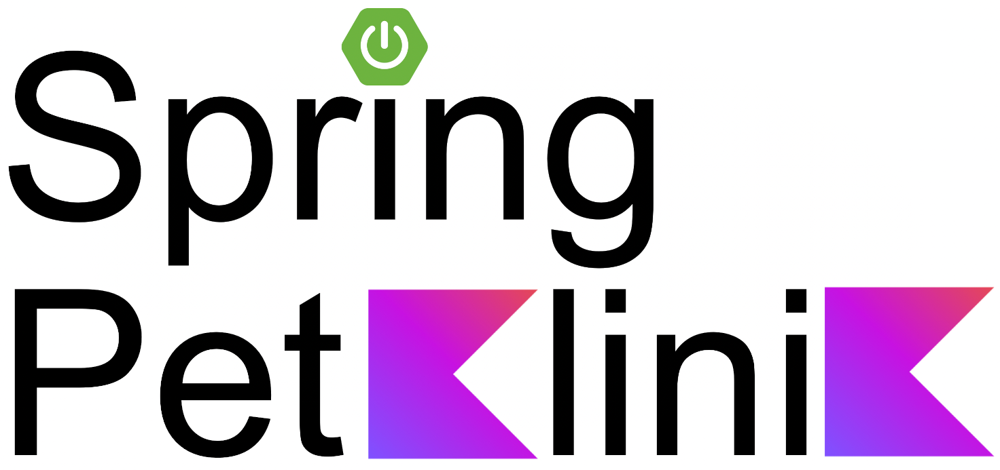

Spring Petklinik is a Kotlin fullstack variant of the original [Spring Petclinic](https://github.com/spring-projects/spring-petclinic) example with [Kotlin/Wasm](https://kotlinlang.org/docs/wasm-overview.html) for the frontend instead of JavaScript or TypeScript. Most of the rendering is still done on server-side, but some dynamic parts are implemented on client-side (validation or dynamic update of some pages like the owner search result).

This project requires Java 24+ and leverages:
 - [Kotlin multiplatform support](https://kotlinlang.org/docs/multiplatform.html) to share code between Kotlin/Wasm and Kotlin/JVM using a shared module
 - [Programmatic bean registration](https://docs.spring.io/spring-framework/reference/7.0/core/beans/java/programmatic-bean-registration.html) with [`BeanRegistrarDsl`](https://docs.spring.io/spring-framework/docs/current-SNAPSHOT/kdoc-api/spring-beans/org.springframework.beans.factory/-bean-registrar-dsl/index.html) that will be introduced with Spring Framework 7 and Spring Boot 4
 - [kotlinx.html](https://github.com/Kotlin/kotlinx.html) for template rendering (hopefully later replaced by a first class [Compose HTML](https://github.com/JetBrains/compose-multiplatform/blob/master/tutorials/HTML/Building_UI/README.md) support)
 - Virtual Threads

To run just the Petklinik application:
 - Run `docker-compose up postgres`
 - Run `./gradlew bootRun`
 - Go to `http://localhost:8080`

To run both Petklinik and the AI image generation service:
 - Run `./gradlew clean build bootBuildImage`
 - Define an `OPENAI_API_KEY` environment variable
 - Run `docker-compose up`
 - Go to `http://localhost:8080`
