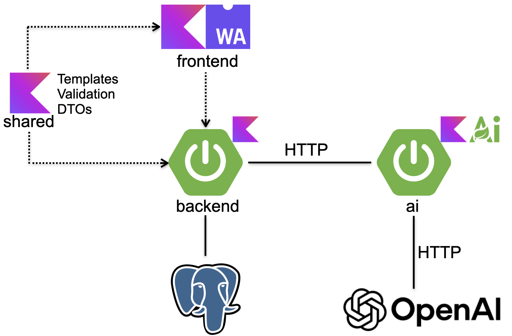

Spring Petklinik is a Kotlin fullstack variant of the original [Spring Petclinic](https://github.com/spring-projects/spring-petclinic) with Kotlin.

## Architecture

Key characteristics:
 - [Kotlin/Wasm](https://kotlinlang.org/docs/wasm-overview.html) for the frontend instead of JavaScript or TypeScript
 - Most of the rendering is still done on server-side, but some dynamic parts are implemented on client-side (validation or dynamic update of some pages like the owner search result)
 - [Kotlin multiplatform support](https://kotlinlang.org/docs/multiplatform.html) to share code between Kotlin/Wasm and Kotlin/JVM using a shared module
 - Preview of Spring Boot 4 and Spring Framework 7 with its new [Programmatic bean registration](https://docs.spring.io/spring-framework/reference/7.0/core/beans/java/programmatic-bean-registration.html) with [`BeanRegistrarDsl`](https://docs.spring.io/spring-framework/docs/current-SNAPSHOT/kdoc-api/spring-beans/org.springframework.beans.factory/-bean-registrar-dsl/index.html)
 - [kotlinx.html](https://github.com/Kotlin/kotlinx.html) for template rendering (hopefully later replaced by a first class [Compose HTML](https://github.com/JetBrains/compose-multiplatform/blob/master/tutorials/HTML/Building_UI/README.md) support)
 - Virtual Threads
 - OpenAI interactions implemented in a distinct application based on Spring AI
 - CDS Buildpack support used to speedup containers startup 

## Requirements

  - Java 24+
  - Docker

## Getting started

To run just the Petklinik application in development mode:
 - Run `./gradlew :backend:bootRun`
 - Go to `http://localhost:8080`

To run all services in production mode:
 - Run `./gradlew clean build bootBuildImage`
 - Define an `OPENAI_API_KEY` environment variable
 - Run `docker compose --profile all up`
 - Go to `http://localhost:8080`
